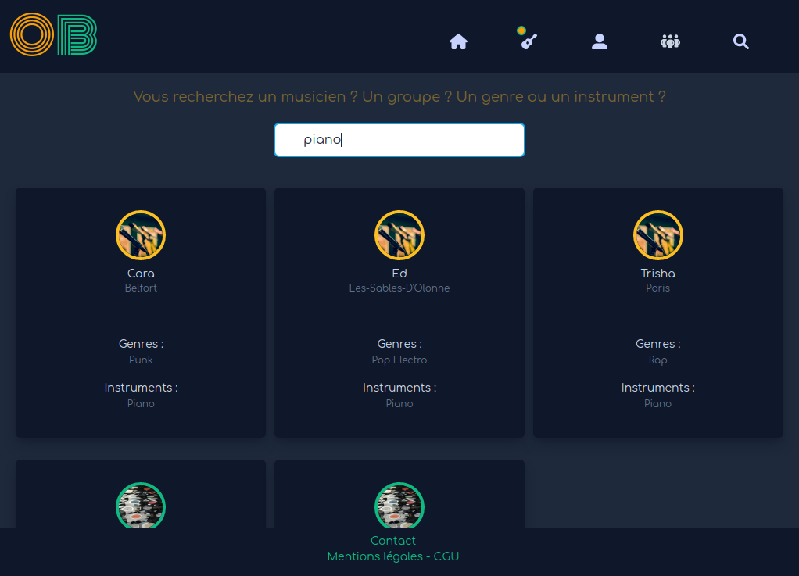
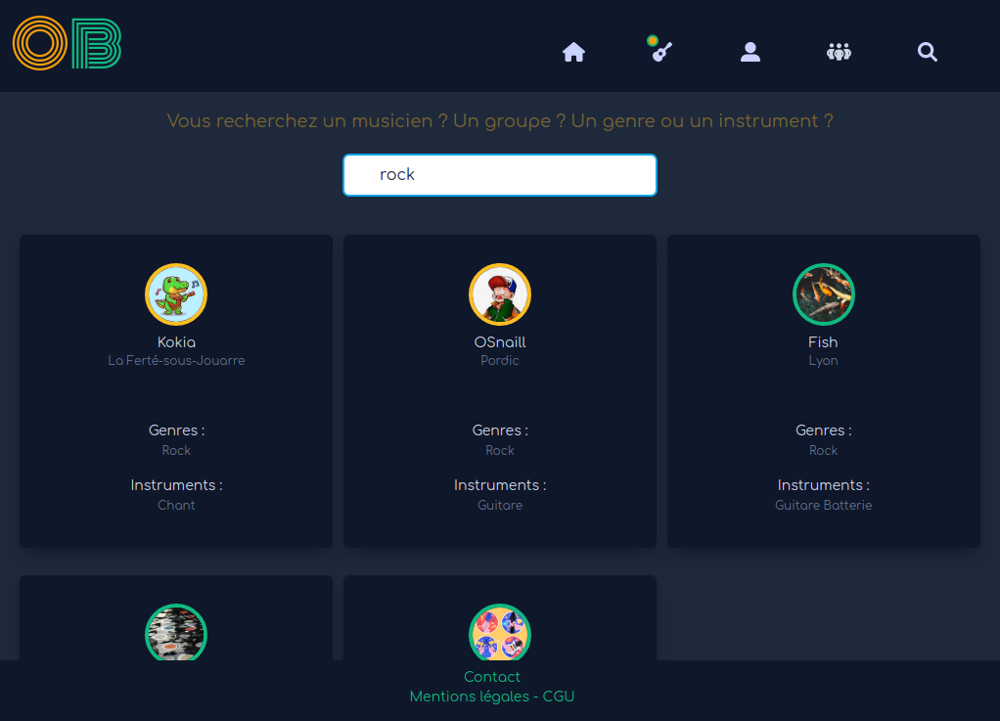
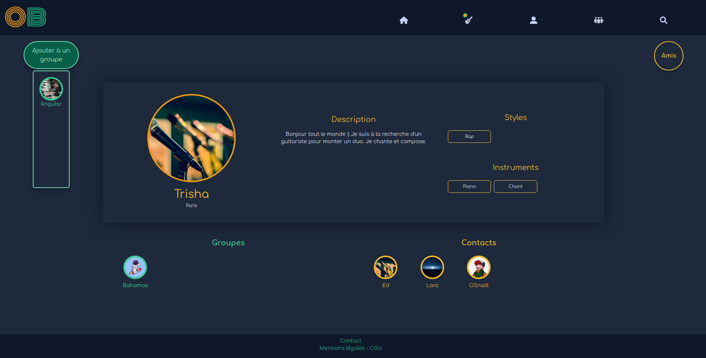
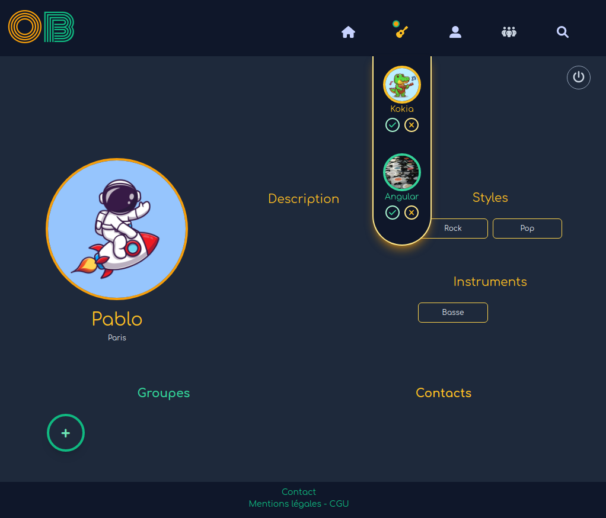
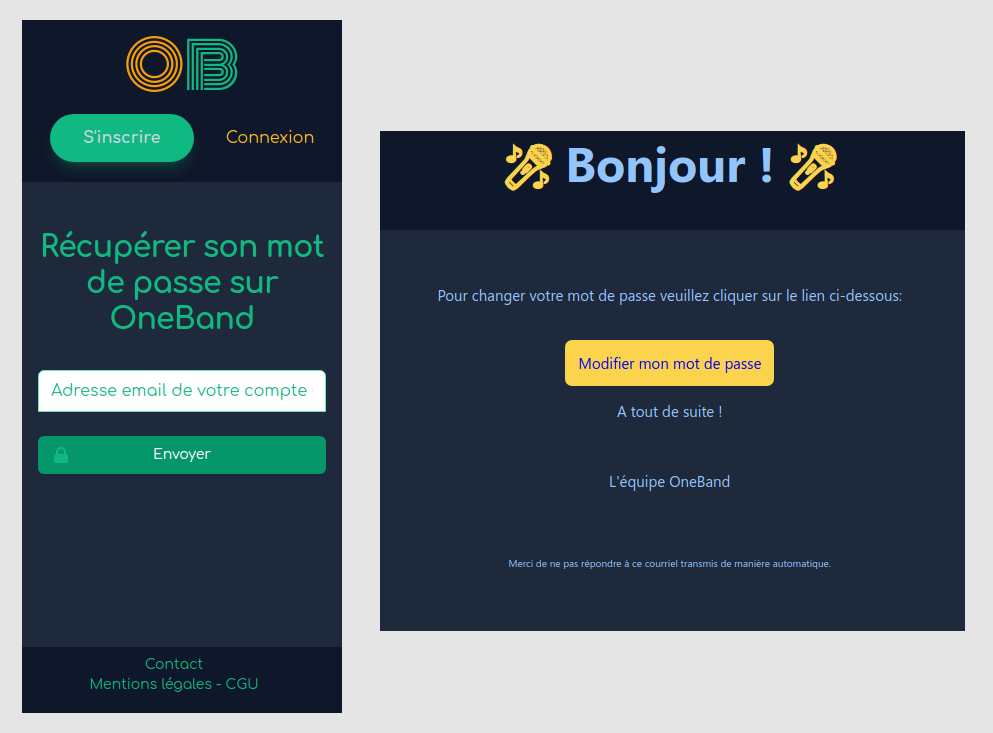

# OneBand

OneBand is a social network for musicians, both solo artist or band, amateur or professionnal.  
Team project made during my training in web development.

## Front-end technologies

- React
- Redux
- Axios
- Tailwind CSS

## Install

- `npm install`
- `yarn add react-hot-toast`
- `yarn start`

## Search users and bands by name, instrument or music genre

## Send a friend request and invite member to your band

## Accept or decline friend and band requests

## Reset forgotten password

